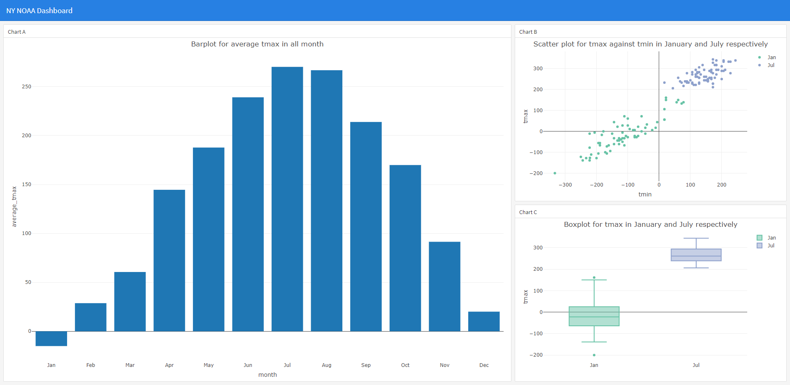

{width=100%}

The webpage is a brief introductory of myself. 
 
  
   
    
    
## Introduction

Hi, I am Shun Xie and you can call me Leo if it is more convenient for you. I am currently a first year Biostatistics student under public health data science track at Columbia University. But before I come to the US, I spent 8 years studying in the UK. I enjoy the time in both places and I also enjoy traveling all around world. For academic part, I am willing to learn new thesis and applying it. During my graduate study at Imperial, I was focused on applying distance correlation into an economic project, which no other economic paper has considered the new technique. I believe that the new methods can capture more non-linear correlation and therefore, it will be very helpful in data analysis. 

## Personal Information

A detailed resume is included in this webpage [resume](resume/resume.html) which is also built in R Markdown. Links to my github document and linkedin are contained in the [personal link](personal_link.html) webpage.

## Github 

Here is some illustration of my work in github. In the example, I create a dashboard for NY NOAA dataset. 

The dataset is a public access to weather data, containing id as the weather station id for NY stations. The data has a time range from 1981-01-01 to 2010-12-31. It contains 7 variables, in which I only consider four in this example: namely weather station ID as id variable, date of the data collected,  tmax and tmin variable measuring the maximum and minimum temperation, in tenths of degrees C. 

It is natural to consider if the data has high average temperature in summer, and low average temperature in winter. According to below (screen shot of the dashboard), the bar plot on the left [dashboard](dashboard.html) gives the underlying distribution. July has the highest average maximum temperature and January has the lowest average maximum temperature. Then, on the right of the dashboard, I further investigate datasets in January and July by making a scatter ploytt of tmax and tmin for two months as well as the boxplot of tmax in the two months. It seems like tmax in January is more spread out than tmax in July.

The dashboard can be accessed [here](dashboard.html).

The repository of the webpage and dashboard can be accessed [here](https://github.com/ShunXie/sx2337.github.io)

